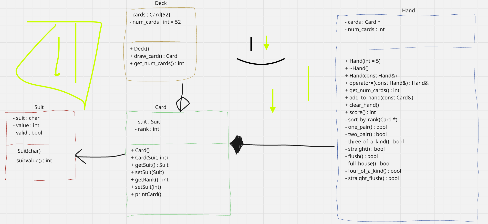

# Project 3 - Classes via Poker Scoring
For this project, you will learn how to score Poker games under OOP.  \
While you are not required to implement the actual game itself, this project's main purpose is to help you combine your recent knowledge of classes with array manipulation to figure out how to score a poker hand. \

Essentially, you will do two things:
1. Declare and implement all class methods.
2. Demonstrate a basic functionality of creating a hand, creating a deck, drawing 5 cards from the deck onto the hand, and then scoring that hand.

For extra credit:
1. Decide how many rounds to play (between 3 and 10), perform requirement #2 for that many rounds, and print the total sum of the scores across that many rounds.

# Class Structure
You are given five classes in this project: Suit, Card, Hand, Deck, and Exception.  However, Suit and Exception are already done for you.  \
For this project, you will have to interpret the given UML Diagram below to write the classes.  \
While I will not write the method declarations for you this time in the .hpp, I will give you a description on what each method should do in each class's separate section.\
You are responsible for throwing an Exception when a certain action could cause problems.\
An example of an exception to throw is if you are trying to draw a card from the deck if there are no cards left in the deck.\
There are more possible exception cases to consider than this, so try to think of as many cases as you can.  

## UML Diagram

# Suit
This is already done for you.

# Card
This class contains two member variables: suit (type Suit) and rank (type int).  \
This class contains two constructors: one default and one passing in the Suit.  Both of these have been partially done for you, as I had forgotten to show you initialization lists.\
This class contains getters and setters for both member variables.\
This class contains a printCard() function.  This has been done for you.  

# Deck
This class contains two member variables: cards (static array of 52 Cards) and num_cards (type int).\
This class contains a single, default constructor that is already done for you.  It creates the deck and shuffles it.  \
This class contains one getter to the number of cards remaining.\
This class contains one auxilary function to draw a card from the deck.  The card drawn from the deck should affect the number of remaining cards in the deck.
I have included the function to draw a card in both deck.hpp and deck.cpp, although it is incomplete.  This shows you how to throw an Exception.  

# Hand
This class contains two members: cards (pointer to Card) and num_cards (type int).\
This class contains a constructor with default argument of 5.\
This class contains the Big 3: destructor, copy constructor, assignment operator.\
This class contains a getter to the number of cards in the hand.\
This class contains a method to add a card to the hand.\
This class contains a method to empty out the hand.\
This class contains a method to score the hand.\
This class contains a method to sort the hand by rank.  This is already done for you.\
This class contains multiple boolean functions that represent each of the hand combinations described below. (hint: throw exception if the hand doesn't have 5 cards).

# Due Date
This project will be due on April 16th, 2026, so you are given 4 weeks to do this project.  

# Poker Hand Combinations
Below are the different poker hand combinations you need to be able to implement, ordered from highest priority to lowest priority.

## Straight Flush
This is the rarest poker hand that one can get, and can only happen when one gets both a straight and a flush on the same hand. 
See the Straight subsection to see how Aces are determined in a straight flush, since they behave a little differently.
If you get a straight flush, the score should be 100.

For example, a hand of [3S, 4S, 7S, 6S, 5S] would qualify as a straight flush, since there is a straight from 3 to 7 and all cards are Spades (S).  

## Four of a Kind
This poker hand can only happen when a poker hand contains 4 of the same rank.  
If you get a four of a kind, the score should be 90.

For example, a hand of [4D, JD, JS, JH, JC] would qualify as a four of a kind, since 4 of the 5 cards contain a Jack (J).    

## Full House
This poker hand can only happen when you have both a 3 of a kind and a pair in the same hand, with the rank of the 3 of a kind being different to the rank of the pair.
If you get a full house, the score should be 75.

For example, a hand of [7H, 2C, 2D, 7D, 7S] would qualify as a full house, since 7 is the 3 of a Kind and 2 is the pair.

## Flush
This poker hand can only happen when all 5 cards in the hand have the same suit.
If you get a flush, the score should be 60.

For example, a hand of [QC, 10C, AC, 4C, 3C] would qualify as a flush, since all 5 cards contain a Club/Clover (C).

## Straight
This poker hand can only happen when all 5 cards are one rank off of each other.
For aces, however, they can only appear in a straight at the beginning or at the end.
If you get a straight, the score should be 50.

For example, hands of [8S, QH, 9C, 10D, JS], [3D, 5C, 4S, AH, 2D], and [KD, JC, AS, 10S, QD] all qualify as straights.  

## Three of a Kind
This poker hand can only happen when 3 cards have the same rank.  
If you get a 3 of a kind, the score should be 35.  

For example, a hand of [9H, JC, JS, 3H, JD] would qualify as a three of a kind, since Jack (J) shows up 3 times.  

## Two Pairs
This poker hand can only happen when 2 separate pairs of cards of the same rank are in one hand.
If you get two pairs, the score should be 20.

For example, a hand of [8C, 10D, AC, AS, 8H] would qualify as two pairs, since there are two pairs of 8 and Ace.

## One Pair
This poker hand can only happen when 1 pair of cards of the same rank are in one hand.
If you get one pair, the score should be 15.

For example, a hand of [AS, 10D, 10H, JC, 3H] would qualify as one pair, since there is only pair of 10.  

## High Hand
This poker hand is if no other combination discussed above matches the current hand.  In this case, get the score of the highest ranked card.  
In the case of a face card or an Ace, Jack = 11, Queen = 12, King = 13, and Ace = 14.

For example, a hand of [3S, 7H, 6D, 5S, QC] would have a score of 12, since Queen is the highest ranked card and no combination fits this hand.  

